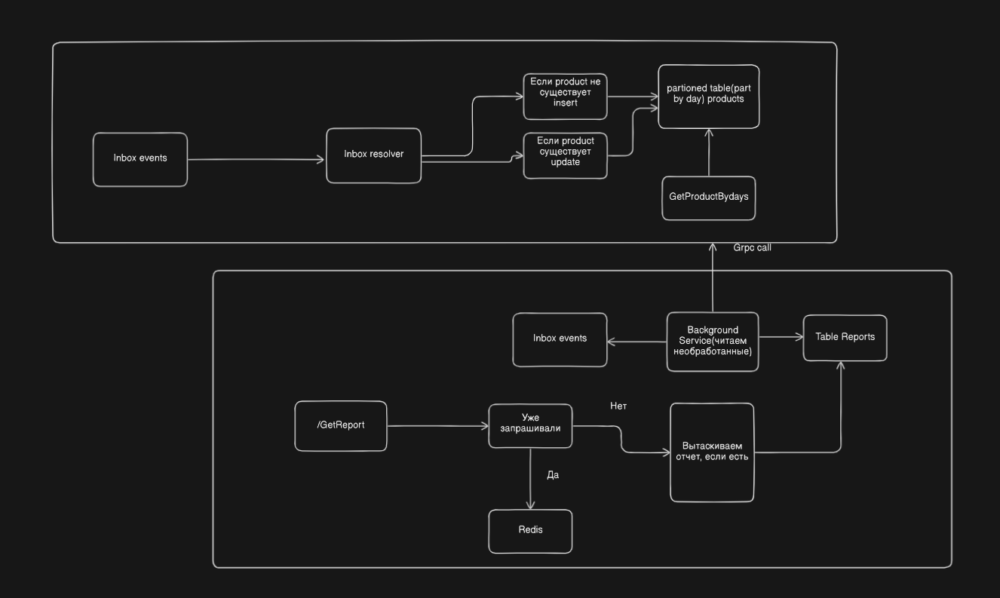
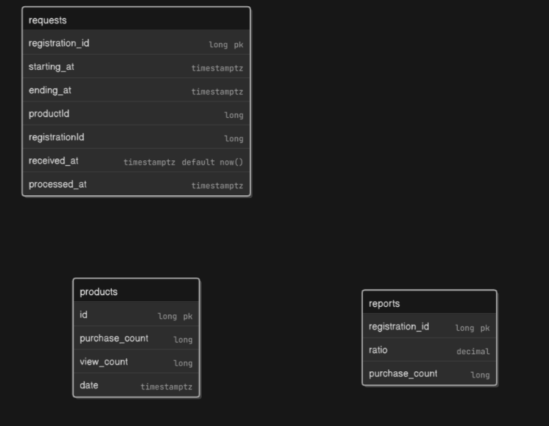

# OzonReportService

Так как в задании не было указано, что есть source сервис со статистикой я придумал его сам. Такое разделение отвественности должно обеспечить бесперебойную работу сервиса. Так же планировал использовать Redis для того чтобы при повторных запросах не ходить в постгрю, но кажется не успеваю это реализовать.

Краткое описание второго сервиса(или части сервиса отвественного за продукты), grpc api с единственным методом получить статистику по товару зная его id и промежуток времени, в сервисе есть партицирование по дням, что делает подсчет статистики эффективным.
